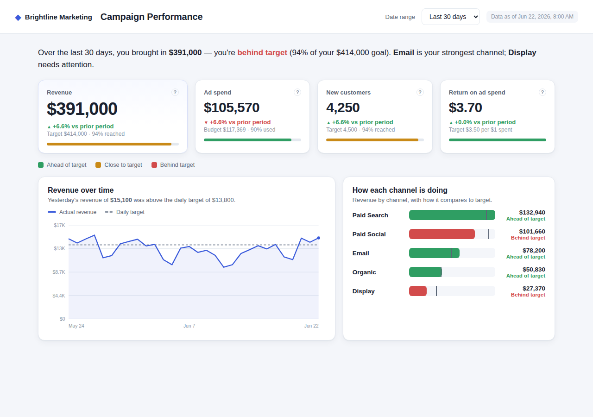
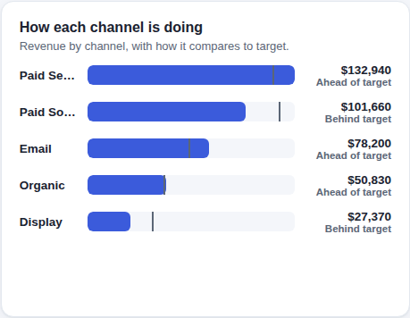
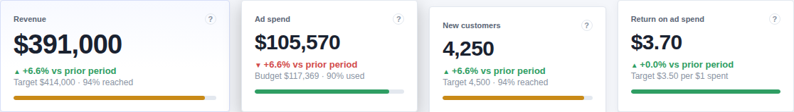
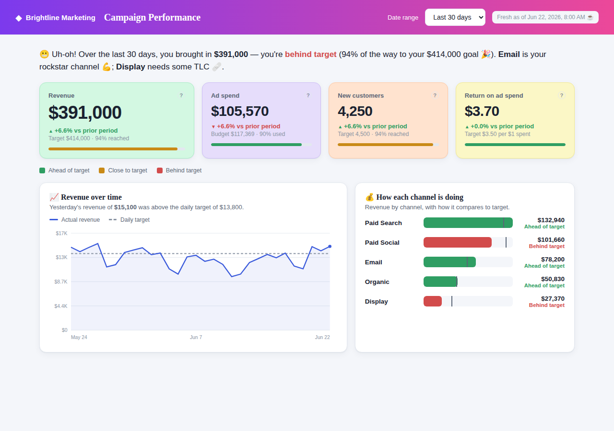

# ux-skills

**A UX reviewer your coding agent can actually iterate against.**

Agents are good at building UIs and bad at noticing what's wrong with them.
This repo is a review skill that looks at a running app the way a senior UX
designer would — walks the user's real tasks, measures what can't be
eyeballed, simulates first-time users, judges against genre conventions —
and returns prioritized, evidence-backed feedback an implementing agent can
act on directly.

In our detection eval, an Opus reviewer following this skill found **20 of 21
seeded defects** blind. The same model given a vague "give me feedback on the
usability and visuals" prompt found 10.

## How it reviews

The skill (`skills/ux-review/`) takes a running app plus a **brief** — the
app's goal, target persona, tasks with success criteria, and tone words —
and works three staged passes (`raw.md` → `findings.md` → `report.md`):

1. **Observe.** Drive the app along each task's happy path (and beyond it:
   empty states, errors, other viewports), screenshot everything, and work a
   structured checklist on every screen so coverage doesn't depend on what
   the model happens to notice. Three evidence mechanisms do the work
   judgment can't be trusted with:
   - **Style inventory** (`tools/style-inventory.mjs`) — a DOM measurement
     pass: type/color/spacing census, WCAG contrast math, alignment
     near-misses down to the pixel, overflow. Vision models can't reliably
     eyeball a 9px misalignment or 11px type; this measures instead.
   - **Fresh-eyes probes** — context-free subagents shown a single
     screenshot: "what is this app for?", "where would you click to
     ⟨outcome⟩?". Discoverability becomes an observed result, not an opinion.
   - **Task-completion walkthrough** — every promise the UI makes gets
     verified where the persona acts; a task that can't reach its success
     criterion is always the headline.
2. **Diagnose.** Failed checks become findings only if they hurt *this*
   persona's goal, framed against a **genre precedent library**
   (`precedents.md` — where users trained by every other checkout /
   listing / dashboard will look). Aesthetic findings must cite a
   measurement or a tone constraint the brief actually states — no
   unmeasured taste — and cap at medium severity unless legibility breaks.
3. **Report.** Worst-first findings, each with the observation, why it
   matters for the persona, and a suggested direction — led by a **"Top 3
   changes"** root-cause synthesis. On iteration rounds the reviewer
   re-verifies the previous report first (fixed / unchanged / regressed)
   instead of re-litigating it.

There's also a **thorough mode** (three independent reviewer passes,
consolidated) for pre-ship gates.

## Does it work? The detection eval

We seed known defects into a well-built dashboard app and check whether a
blind reviewer finds them. The clean baseline:



Seven variants hide 21 defects across three difficulty classes. Broken
encodings — every channel bar the same blue, the legend deleted, status in
uniform gray:



Craft defects designed to be invisible to eyeballing — the third card sits
exactly 9px low, one card carries a rogue shadow, radii and type sizes
quietly disagree (this is what the style-inventory tool exists for):



And register defects — emoji-and-slang copy, decorative pastel cards, a
novelty display font on a product whose brief demands "professional, calm,
trustworthy":



### Results (2026-07-07, single blind run per cell)

Each model reviewed all 7 variants twice: **skill mode** (following this
skill) and **control mode** (same app access, vague "feedback on the
usability and visuals" prompt). Defects detected, of 21:

| | Haiku | Sonnet | Opus |
|---|---|---|---|
| **with the skill** | 12.5 | 18 | **20** |
| **vague prompt (control)** | 8 | 12 | 10 |

What the numbers say:

- **The skill lifts every model — and the strongest model the most.** Under
  a vague prompt even Opus does a shallow, top-of-mind pass. The skill makes
  it spend its capability where defects live: 10 → 20.
- **The model still matters.** With identical instructions: 12.5 → 18 → 20.
  Haiku's misses are judgment (it praised the emoji copy; it never noticed
  the deleted KPI targets); process alone doesn't fix that.
- **Measured beats eyeballed.** No control run found the 9px misalignment or
  cited a single measurement; one called the misaligned variant
  "production-ready". Skill reviewers caught the craft variant 3/3 with
  exact deltas.
- **False strengths are the control's signature failure.** Control reports
  praised deleted freshness stamps and "consistent" broken grids six times
  across the matrix. Skill-mode Sonnet/Opus: zero, across 14 reports.
- Cost: a skill review runs ~2.5× the tokens of a vague-prompt review.

Full data: `evals/results/` (baseline, spot checks, full matrix, caveats —
including two eval-integrity bugs we caught and fixed mid-run).

## Run it

**Review your own app:** point an agent at `skills/ux-review/SKILL.md` with
a brief (see `DESIGN.md` for the brief contract, `evals/apps/*/brief.md` for
examples) and a running URL.

**Run the detection eval locally:**

```sh
python3 -m http.server 4010 -d evals/apps        # serve the eval apps
node evals/run-evals.mjs --dry-run               # preview all jobs, no tokens
node evals/run-evals.mjs --models sonnet --variants v5,v6 --skill
```

**Run it in CI:** `.github/workflows/ux-eval.yml` is a manually-triggered
GitHub Action (models / variants / skill / control inputs; defaults run the
full matrix). It authenticates the Claude Code CLI with a Claude
subscription: run `claude setup-token` locally and add the result as the
`CLAUDE_CODE_OAUTH_TOKEN` repo secret. Results land in the workflow step
summary and as an artifact. See `evals/README.md`.

## Tenets

- **Checklists for rigor, insights for output.** Structured passes so
  coverage doesn't depend on what the model notices; a prioritized,
  goal-anchored report rather than a scorecard.
- **Usability first; no unmeasured taste.** Aesthetic feedback is in scope
  only with evidence: DOM measurements for craft, the brief's stated tone
  for register. "Looks dated" is not a finding.
- **Evidence over judgment.** Measurements, probes, precedents, and multiple
  reviewers wherever an opinion can be replaced by an observation.
- **For agents primarily, humans second.** Success is measured with the
  detection eval, not vibes.

## Layout

- `skills/ux-review/` — the skill: `SKILL.md` (staged process),
  `checklists.md` (spine + per-surface lenses + measured aesthetics),
  `precedents.md` (genre conventions), `examples.md`,
  `tools/style-inventory.mjs` (DOM measurement).
- `DESIGN.md` — the design: brief contract and review method, with sources.
- `evals/` — the harness: synthetic apps, defect variants + ground truth,
  screenshot helper, `run-evals.mjs` orchestrator, results.
- `.github/workflows/ux-eval.yml` — the manually-triggered eval Action.
