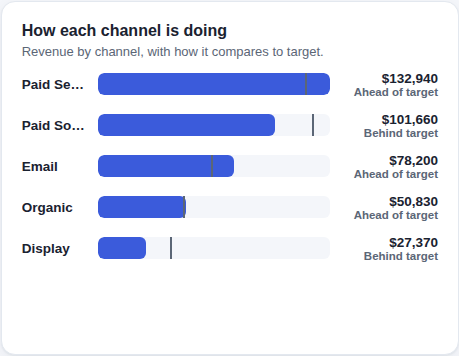

# ux-review

A repeatable UX review for coding agents.

`ux-review` runs against a working web app. It checks whether a defined user can
complete the product's core tasks, records evidence from the rendered UI, and
returns a short list of prioritized changes for the implementing agent.

It is particularly useful for improving usability of apps built by agents,
which can look polished and work while still having UX issues such as missing
labels, unexplained status icons, and confused visual hierarchies. The skill
focuses on usability and measured interface craft, not subjective taste.

## Usage

**Install:** `npx skills add crowecawcaw/ux-skills --skill ux-review`

Alternatively, follow your agent's instructions for installing skills and use
the `skills/ux-review/` directory.

## Example

**1. You ask for a review**

> Do a UX review of the dashboard at `http://localhost:4010`. The user is a
> paid-growth lead deciding where to adjust spend. They need to compare channel
> revenue and identify which channels are ahead of or behind target.

**2. The skill inspects the running app**

It walks the workflows and captures screenshots internally. One captured state:



**3. You get a prioritized report**

1. **High — Status is not visually encoded.** Every bar is blue and the legend
   is missing.
2. **Medium — Behind-target channels do not stand out.** Every status uses the
   same muted gray treatment.
3. **Low — Channel names are ambiguous.** “Paid Search” and “Paid Social” are
   truncated to nearly identical labels.

## How it works

1. Define the target user, their goals, and the workflows they need to complete.
2. Walk those workflows and capture screenshots of every relevant state.
3. Give fresh subagents a screenshot and a goal. Ask where they would act and
   what would make the goal difficult, unclear, or impossible.
4. Check every screen against established UX practices and DOM measurements.
   For example: does every color have a consistent, learnable meaning?
5. Diagnose which observations materially affect the target user's goal and
   merge symptoms that share a root cause.
6. Report the few highest-impact changes, followed by the supporting findings
   in priority order.

The detailed process is in [`skills/ux-review/SKILL.md`](skills/ux-review/SKILL.md).

## What it needs

- a running app the agent can operate
- a brief describing the product, target user, primary tasks, success criteria,
  scope, and intended tone
- happy-path scripts or clear steps for reaching the important states

See [`DESIGN.md`](DESIGN.md) for the brief format and
[`evals/apps/`](evals/apps/) for examples.

The app should already be running. Browser automation is required to walk the
flows and capture screenshots. The included style inventory requires Node.js
and `playwright-core`:

```sh
npm install
```

The review writes three files:

- `raw.md` — screenshots, task checks, measurements, and observations
- `findings.md` — supported issues, deduplicated and graded by impact
- `report.md` — the final review, ordered by priority

Give `report.md` to the implementing agent. On a later pass, provide the prior
report so the reviewer can mark findings as fixed, unchanged, or regressed.

## How it's tested

The included eval seeds 21 known defects across seven variants of one dashboard
and compares skill-guided reviews with a generic UX-feedback prompt. In one
blind run per model, the skill found 12.5, 18, and 20 defects versus 8, 12, and
10 for the controls, using about 2.5 times as many output tokens. This is a small
detection test, not a general UX-quality benchmark; see the
[`full report`](evals/results/2026-07-07-full-matrix.md) and
[`eval harness`](evals/README.md).
